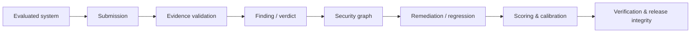

# FAS-Bench

**Forensic Agent Security Benchmark — an evidence-first benchmark for AI agents, security scanners, and security-analysis systems that need to prove security claims, not merely produce findings.**

[](https://github.com/LloydCoder/fas-bench/actions/workflows/ci.yml)
[](https://github.com/LloydCoder/fas-bench/actions/workflows/security.yml)
[](LICENSE)
[](pyproject.toml)

## Visual proof

FAS-Bench evaluates the chain from a security signal to an independently checkable result:



The repository contains a reproducible public development corpus, deterministic schemas and evaluators, secure execution primitives, independent verification, contamination controls, and release/provenance contracts. The public FAS-001–FAS-020 corpus is **not** a secret official evaluation set.

## Why FAS-Bench

Most security benchmarks emphasize whether a tool detects a pattern. FAS-Bench asks whether the resulting claim can survive evidence-based verification.

| Dimension | Question |
|---|---|
| Finding | Did the system identify the relevant condition? |
| Evidence | Can the submitted evidence be independently verified? |
| Reachability | Is the relevant operation or path actually reachable? |
| Security boundary | Do identity, authorization, IAM, network, sandbox, policy, or runtime controls change the path? |
| Attack path | Can the ordered security-relevant path be reconstructed? |
| Exploitability | Is the claimed impact exercisable under the case assumptions? |
| Remediation | Did the change remove the underlying condition? |
| Regression | Was the condition later reintroduced? |
| Calibration | Does confidence track correctness and uncertainty? |
| Efficiency | What execution, time, token, or compute cost was required when measured? |

**Core invariant:** a plausible explanation is not evidence, a source pattern is not automatically an exploitable path, and a correct verdict with fabricated evidence is not equivalent to a verified result.

## Quick Start

Requires Python 3.12+ and Git. Docker is additionally required for secure-execution integration checks.

```bash
git clone https://github.com/LloydCoder/fas-bench.git
cd fas-bench
python -m venv .venv && source .venv/bin/activate
python -m pip install -e ".[dev]"
fas-bench benchmark doctor
```

A successful `benchmark doctor` run gives an immediate repository-health result without requiring a hidden corpus or external service.

## Installation

### Development install

```bash
python -m pip install -e ".[dev]"
```

### Windows PowerShell

```powershell
python -m venv .venv
.venv\Scripts\Activate.ps1
python -m pip install -e ".[dev]"
```

### Build and install a wheel

```bash
python -m build
python -m pip install --force-reinstall dist/*.whl
```

FAS-Bench currently defines the package as Python `>=3.12`; the repository CI validates Python 3.12 and 3.13.

## Usage

### Validate the public corpus

```bash
fas-bench corpus validate
fas-bench cases validate-all
fas-bench cases validate-gold --reproduce
```

### Validate evidence

```bash
fas-bench evidence validate tests/fixtures/integrated/FAS-001.json --case FAS-001 --json
```

### Evaluate a finding

```bash
fas-bench evaluate finding --case FAS-001 --submission tests/fixtures/phase5/FAS-001-gold.json --strict --json
```

### Inspect graphs

```bash
fas-bench graph validate <graph.json>
fas-bench graph paths <graph.json>
fas-bench graph diff <before.json> <after.json>
```

### Produce analysis and reports

```bash
fas-bench self-test --output /tmp/fas-bench
fas-bench analyze /tmp/fas-bench/results.json --bootstrap 200 --seed 0
fas-bench report /tmp/fas-bench/results.json --output /tmp/fas-bench-report
```

### Verify a release manifest

```bash
fas-bench release verify <manifest.json>
fas-bench verification manifest <manifest.json>
fas-bench verification certify <manifest.json> --security-status PASS --output verification-report.json
```

Replace angle-bracket placeholders with paths in your environment.

## Configuration / options

FAS-Bench is primarily configured through CLI arguments and versioned repository contracts rather than a mutable global configuration file.

| Option / contract | Default / current value | Notes |
|---|---|---|
| Python | >=3.12 | CI validates 3.12 and 3.13 |
| Package version | 0.1.0 | Declared in `pyproject.toml` |
| Public corpus | FAS-001–FAS-020 | Development/practice data |
| JSON Schema | Draft 2020-12 | Schema contracts are checked in |
| Scoring policy | v0.1 | Research configuration; not a universal weighting claim |
| Secure execution | Docker provider | Fail-closed when required isolation is unavailable |
| Oracle image | Immutable digest | Do not replace with a mutable tag |
| Network for candidate execution | Denied in current provider | Host execution is not an allowed fallback |

Run `fas-bench <command> --help` for command-specific options.

## Features

| Area | Capability |
|---|---|
| Benchmark contract | Versioned taxonomy, verdict semantics, evidence model, and comparability rules |
| Corpus | FAS-001–FAS-020 public cases with structured expected artifacts and deterministic validation |
| Evidence | Case-relative artifact resolution, structured fact verification, location checks, duplicate detection |
| Evaluation | Finding, claim, verdict, conditional exploitability, and evidence-integrity evaluation |
| Graphs | Canonicalization, identity, path extraction, alternate-path discovery, semantic comparison, and diffs |
| Remediation | Baseline/post-remediation state, alternate-path and regression analysis |
| Scoring | Decomposable measurements, calibration, uncertainty, stratification, and reporting |
| Secure execution | Immutable images, network isolation, resource bounds, artifact validation, and fail-closed behavior |
| Integrity | Content-derived identities, contamination scans, independence audits, reproducible release manifests |
| Verification | Independent reference checks, tamper tests, certification, and reproducibility contracts |
| Agentic evaluation | Immutable environments, ordered multi-turn scenarios, and explicit execution-boundary delegation |
| Adversarial robustness | Attack-class taxonomy, mutation identity, oracle-bound results, and infrastructure-failure semantics |
| Measurement science | Wilson intervals, deterministic bootstrap, inter-rater agreement, and benchmark-conditioned reliability |
| Ecosystem contract | Submission, result, provenance, lifecycle, and human-gated release semantics |

## Documentation

- [Documentation index](docs/README.md)
- [Normative specification](docs/specification.md)
- [Architecture](docs/architecture.md)
- [Reproducibility](docs/reproducibility.md)
- [Trust model](docs/trust-model.md)
- [Threat model](docs/threat-model.md)
- [Secure evaluation](docs/phase9-secure-evaluation.md)
- [Corpus and release](docs/phase10-corpus-release.md)
- [Independent verification](docs/phase10-2-verification.md)
- [Measurement science](docs/phase20-measurement-science.md)
- [Enterprise evaluation ecosystem](docs/phase21-evaluation-ecosystem.md)
- [Governance](GOVERNANCE.md)
- [Contributing](CONTRIBUTING.md)
- [Security policy](SECURITY.md)
- [Support](SUPPORT.md)
- [Changelog](CHANGELOG.md)
- [Citation](CITATION.cff)
- [LLM-oriented project map](llms.txt)

> [!NOTE]
> `docs/specification.md` is the normative benchmark contract. Other documents explain implementation or operations and must not silently redefine benchmark semantics.

## Contributing

See [CONTRIBUTING.md](CONTRIBUTING.md). Contributions should preserve benchmark independence, deterministic semantics, evidence integrity, secure execution boundaries, reproducibility, and historical comparability.

## License and acknowledgements

FAS-Bench is licensed under the [Apache License 2.0](LICENSE).

The project uses JSON Schema, Hatchling, pytest, Ruff, and GitHub Actions. Third-party notices and license obligations remain governed by the applicable upstream licenses.

<details>
<summary>Roadmap and maturity</summary>

FAS-Bench currently documents Phases 1–21, with Phase 21 as the current implementation maturity endpoint. Scientific validity remains an empirical question. In particular, the public corpus is not claimed to be statistically representative, public execution is not equivalent to hidden official evaluation, and implementation maturity does not establish model-training contamination freedom.

</details>

<details>
<summary>Troubleshooting</summary>

If installation fails, confirm Python 3.12+ and retry inside a clean virtual environment.

If corpus validation fails, run `fas-bench benchmark doctor`, then `fas-bench corpus validate` and inspect the first failing case.

If secure-execution tests fail, confirm Docker is installed and available to the current user. Do not bypass the isolation provider by executing candidate code directly on the host.

If a documentation statement conflicts with benchmark behavior, treat [docs/specification.md](docs/specification.md) as the normative contract and report the discrepancy.

</details>

<details>
<summary>Support</summary>

Use [SUPPORT.md](SUPPORT.md) for questions and reproducible bugs. Use [SECURITY.md](SECURITY.md) for security or benchmark-integrity vulnerabilities.

</details>
